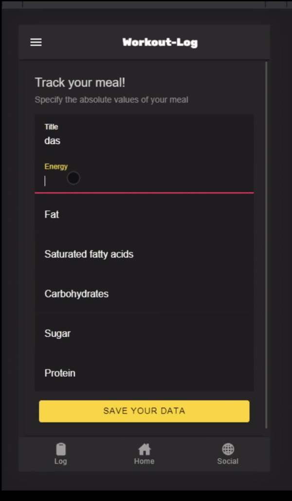

---

  ¨Less sometimes means more"   
  
 

  
<h1> New Semester </h1> 
It's been a while since our last update, but the new semester just started, so we can now fully dedicate ourselves to the development of worklout log again.
  
  But directly we have to start with a negative announcement and that is that Moritz left our team. So for now our team consists only of Rouven and Sebastian.
  
  We also considered merging with the other two members of the nexam team. But since our prototype is already very advanced we decided not to let workout-log die. So you can still be curious about the final app. 
   <h3>Current Prototype</h3>
  

     
 
  
   

   
     
 
  However, since we are down one person, we need to adjust the UC diagram to the new workload. You can find the new UC diagram below.
     

  
       
     
  All the best,  

  Your workout-log team!     

 
  
               
  

{:.list-inline}
