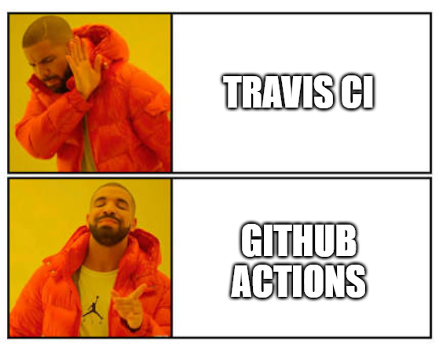

    
This week was probably the hardest and most nerve-wracking week for us so far. But let's just start at the beginning...   
The task for this week was to equip our code with some unit tests, generate a code coverage and to let everything inside an automated CI pipline. Can't be all that hard, can it?
 
Since we are using the Firebase in combination with Ionic for our project, we also wanted to use the directly integrated testing solution that is using the testing framework Jasmine and Karma. 
 
So we thought that we just had to write some small tests and execute them via "npm test" or "npm test --code-coverage", but unfortunately we thought wrong. 
The problem was that we got an error in Karma on every firebase realted page that we could not fix. And that's almost every page! After two lost evenings and still no progress, we decided to simply abandon testing for the Firebase functions and only test our own methods. For our defense: even Stackoverflow did not know what to do.
 
An example test you can find <a href="https://github.com/DHBW-TrainingApp/workout-log/blob/main/src/app/util/bmi/bmi.page.spec.ts">here</a>

  
Now that the tests were working, we wanted to set up the pipeline. Since Sebastian already had some experience in TravisCI and even wrote an <a href="https://github.com/Sebastian-Zok/TravisCI-ePortfolio">e-portfolio</a> about it, we decided to go with it.
As it turned out it was the wrong decision...
  

First we had problems that TravisCI did not recognize the organization and the documentation for this was also very poor.  
After the problem was solved, Travis said that there was a negative account balance. FYI: For Travis CI you need a credit card, because the service was often abused by crypt miners. The problem with the credit card was one of the "history sebastian", as he needed to create a virtual credit card, since he already used travis for his e-portfolio and he doesn't own a real credit card.
  However, that was not the end of the story, because after solving the problem with the negative balance, TravisCI noticed that the free plan only works for one user and not for organizations with more than one user.
  
    
 
So after wasting valuable time again, we switched to GitHub action, which worked like a charm. 
 
The badge for the successful test run can be found on our <a href="https://github.com/DHBW-TrainingApp/workout-log">Github page</a>.
  
And since Prof Berk said: <a href="https://kay.fasten-your-seat-belts.de/my-courses/software-engineering-2021-22/1404/">best grade goes to group with largest number of badges</a>, we added a lot of more or less meaning full badges to our page xD

  
  
  
All the best,  

Your workout-log team!     

 
  
               
  

{:.list-inline}
