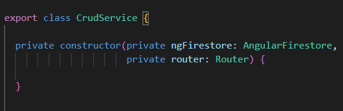
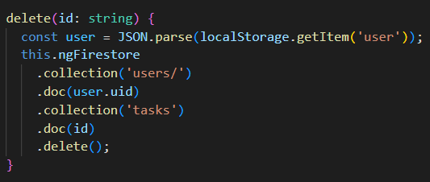

  Welcome to another Workout-Log blog post!  
  This week, we are going to have a look on Metrics
  

  
  <h2>Addendum to the topic Singleton</h2>

  The singleton pattern belongs to the category of generation patterns among design patterns. Its purpose is to prevent more than one object from 
  being created by a class. This is achieved by creating the desired object in a class itself then retrieving it as a static instance. The 
  singleton is one of the simplest, but most powerful patterns in software development.  
  
  <h2>What are the properties of the Singleton pattern?</h2>

  If an instance of a class was created with the Singleton design pattern, it ensures that it really only remains with this single instance. The 
  Singleton makes this class globally accessible in the software. For this there are different methods in the programming languages. So that it 
  remains with only one unique instance, it must be prevented that users can create new instances. This is done by having the constructor declare 
  the pattern as "private". This means that only the code in the singleton can instantiate the singleton itself. This guarantees that only one and 
  the same object can ever reach the user. If this instance already exists, no new one is created. Our Singleton is called "CrudService".    
  
  We created the CurdService class to create methods for communicating with Firebase. The class contains various methods such as the delete function to 
  remove entries from the list. Below you can see the singleton class and the delete function. As mentioned earlier, the constructor is private - a 
  typical property of a singleton - because it should not be possible to create an instance of the CrudService object from outside the class.   

  
     
  
  
  
  

  
  All the best,  

  Your workout-log team!     

 
  
               
  

{:.list-inline}
