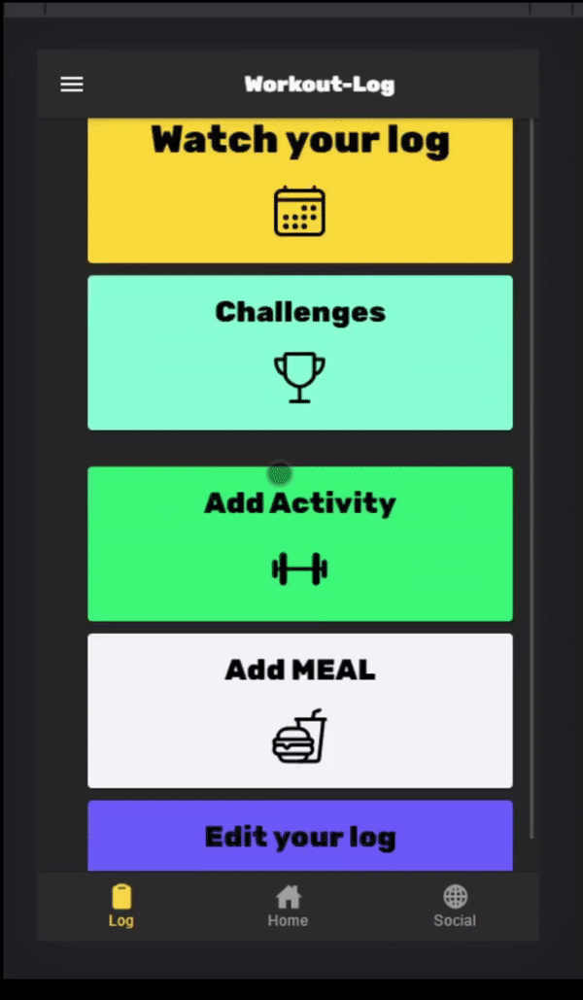

  
"Never say never because limits, like fears, are often just illusions" ~ Michael Jordan
  
  
  Welcome to another Workout-Log blog post!  
  This week, we are going to have a look on Metrics.
  

  
  <h4>But First: A little addendum to our last blog post about design patterns</h4>
  As you know we didn't figured out how to implement the prototype design pattern, so we are going to show you how we used the singleton pattern straight from the beginning of our project.  
  The singleton pattern belongs to the category of generation patterns among design patterns. Its purpose is to prevent more than one object from 
  being created by a class. This is achieved by creating the desired object in a class itself then retrieving it as a static instance. The 
  singleton is one of the simplest, but most powerful patterns in software development.  
  
  <h4>What are the properties of the Singleton pattern?</h4>

  If an instance of a class was created with the Singleton design pattern, it ensures that it really only remains with this single instance. The 
  Singleton makes this class globally accessible in the software. For this there are different methods in the programming languages. So that it 
  remains with only one unique instance, it must be prevented that users can create new instances. This is done by having the constructor declare 
  the pattern as "private". This means that only the code in the singleton can instantiate the singleton itself. This guarantees that only one and 
  the same object can ever reach the user. If this instance already exists, no new one is created. Our Singleton is called "CrudService".    
  
  We created the Crud-Service class to create methods for communicating with Firebase. The class contains various methods such as the delete function to 
  remove entries from the list. Below you can see the singleton class and the delete function. As mentioned earlier, the constructor is private - a 
  typical property of a singleton - because it should not be possible to create an instance of the CrudService object from outside the class.   

  
  
  
Singleton class CrudService with a private constructor.
   
  
  
  
An example function of the Singleton class

  
  
  <h2>But now let's have a look on metrics</h2>
  For this we used the cloud service SonarCloud and implemented it into our build pipeline. The setup with GitHub actions was very pleasant  
  In our configuration yaml you can see how we achieved the setup:  https://github.com/DHBW-TrainingApp/workout-log/blob/main/.github/workflows/main.yml
   
  And <a href="https://sonarcloud.io/project/overview?id=DHBW-TrainingApp_workout-log">here</a> you can have a look on the report that's created by SonarCloud. As you can see our code passed the test, with only 8 bugs, 87 Code Smells and 2 Security Hotspots. After excluding all the dependencies from the framework and just analysing our own code, we even get rid of the Security Hotspots and two code smells, while we still have 3.3% of code duplication.   
  
   <h4>Code duplication</h4>
  One metric is code duplication that shows how many lines of code occurs more then one time, which makes the programm lengthy and bulky. Often duplicated code is a side effect of cooking spaghetti and makes it hard to fix a bug because it occures on multiple locations. Anyways, we decided to still keep the duplicated lines, because they are only on two locations inside of html-files, where the update and the create form are equally. So its not a big deal. 
  
     <h4>Bugs</h4>
  As the Code analysis shows we have 8 bugs in our code. Four minor and four major ones.  
 One of the  major bugs occures in a auto generated test, where the map method is called, while the return value is ignored. As we didn't write the line it is propably better to just leave it as it is.
    
  The other three major bugs are related to the fact that we are using a custom font, without providing a generic font like Sans as fallback option, while many browsers propably don't support our custom font. As we are planning to create an app, the font will always be available bundeled inside the application, so this isn't a real problem.  
      
  The other minor bugs are realted to missing alt text for images and using b (bold) instead of the more generic strong tag. So also this bugs don't effect us at all, as we are going to create an app.
   
  But anyway, <a href="https://github.com/DHBW-TrainingApp/workout-log/commit/1678215b702c48bedf65886cdfa8ec90821e2b13">here</a> is our commit for increasing the code quality.  
  
    
    <h4>Vulnerabilities</h4>
  One of the most, if not the most, important metric is about security vulnerabilities. Exploits like log4J showed how vulnerable the whole ecosystem was and will be. Did you know that alone in Germany the economical damage through cyberattacks is estimated to be around 200 BILLION!!!
  With this fact in mind it is very disappointing that SonarCloud didn't find any vulnerabilities in our code. Propably you ask yourself now: Isn't it a good sign if there are any vulnerabilities?   Of course, but only if it whould be true :-)    
    
     
  
  Through GitHub's dependabot we already know that our code has 31 vulnerabilities through obsolete dependecies. And as SonarCloud has access to our package.json its some sort of a shame that it did't also checked the dependecies. Luckily GitHub is so awesome and checks repositories automatically <3

  
  So if we are planning to release our app, we will of course fix all of the vulnerabilities. So you can use the app with peace in mind.
    
   <h4>Installation</h4>
   
  If you want you can go and install workout-log already. Just download our repo and hit npm i. After that you can have a look on our app through the 'ionic serve' command inside the browser (Of course you need to have ionic installed). If you want to test on a real device, just type in 'ionic capacitor build android'. After that Android studio will open up with our ionic project inside. From here you can compile the app and bundle it to an APK. You can also connect your device through USB-Debugging and just press the play button. Than Android Studio will upload the APK onto your device and run it from alone. Its also possible to just use a emulator inside the android studio.  If you want to debug the app on a native device, you can use the Chrome devtools. Just keep you USB-Debugging connection, open  the app on your phone and enter the following link chrome://inspect/#devices into the chrome browser on your PC. Now you will see a list where the workout-log app is listed. Just press on inspect and you will be able to use the chrome dev tools just how you know them from the  browser.
   
    

     
 
  
     
  All the best,  

  Your workout-log team!     

 
  
               
  

{:.list-inline}
