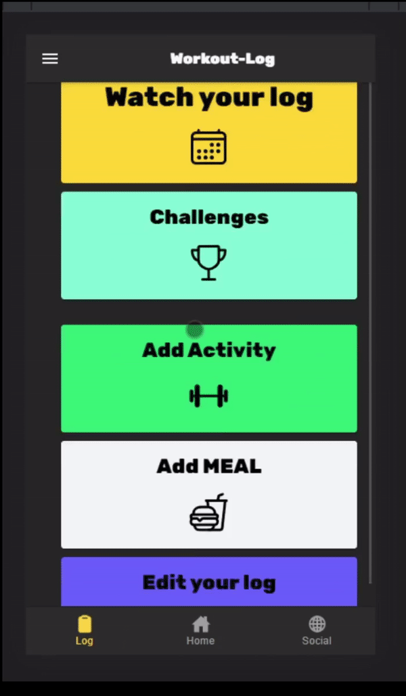
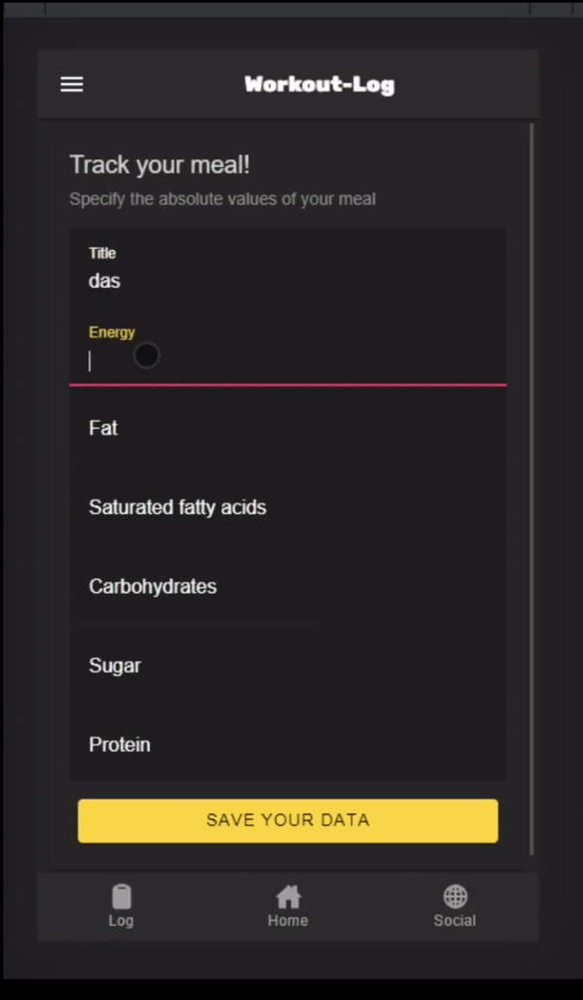

---

  ¨Great achievement is usually born of great sacrifice, and is never the result of selfishness"   
  
 
     

   

     
  
<h1> Written Hand-in </h1> 
Finally the semester is over and we are able to present you our achivements. You’ll get an overview over our documentation, our prototype and the 
presentation files. If something looks corrupted or wrong, simply let us know in the comment section below. Thanks!   
  

<h3>Prototype</h3>
  

     
 

  
   

   
     
 
  
<h3>Presentations</h3>
<ul>
  <li>
  <a href="https://docs.google.com/presentation/d/1A5A3ChnkqPDPrrI0gYowFCCOQfWaCTfa/edit#slide=id.p2" style="color:DarkOrange">Midterm-Slides</a>
    </li>
    <li>
  <a href="https://docs.google.com/presentation/d/15sTj_wvud2rlEarnnOodODbFib9Ftuxi/edit#slide=id.p1" style="color:DarkOrange">Final-Slides</a>
    </li>
    <li>
  <a href="https://docs.google.com/document/d/1YDyeP_-aZmAnObkOPFA6jcTRHUs0F8J4FFrA7vH2zqs/edit" style="color:DarkOrange">Handout</a>
    </li>
    </ul>
    
<h3>GitHub</h3>
  <ul>
  <li>
  <a href="https://github.com/DHBW-TrainingApp" style="color:DarkOrange">Our Organization</a>
    </li>
    <li>
  <a href="https://github.com/DHBW-TrainingApp/workout-log" style="color:DarkOrange">Our Repository</a>
    </li>
    </ul>
  
<h3>Use Case Diagram</h3>
<ul>
  <li>
     <a href="https://github.com/DHBW-TrainingApp/Blog/blob/main/docs/UseCaseDiagramCP.png" style="color:DarkOrange">Old Use Case Diagram</a>
    </li>
  <li>
     <a href="https://github.com/DHBW-TrainingApp/Blog/blob/main/docs/uc_new.drawio.png" style="color:DarkOrange">New Use Case Diagram</a>
    </li>
    </ul>
   
<h3>Use Case Specifications</h3>
<ul>
  <li>
     <a href="https://github.com/DHBW-TrainingApp/Blog/blob/main/docs/UCs/Training.md" style="color:DarkOrange">Training</a>
    </li>
    <li>
     <a href="https://github.com/DHBW-TrainingApp/Blog/blob/main/docs/UCs/createWorkout.md" style="color:DarkOrange">Create Workout</a>
    </li>
     <li>
     <a href="https://github.com/DHBW-TrainingApp/Blog/blob/main/docs/UCs/registration.md" style="color:DarkOrange">Registration</a>
    </li>
   <li>
     <a href="https://github.com/DHBW-TrainingApp/Blog/blob/main/docs/UCs/challenge.md" style="color:DarkOrange">Challenges</a>
    </li>
  <li>
     <a href="https://github.com/DHBW-TrainingApp/Blog/blob/main/docs/UCs/MealPlan.md" style="color:DarkOrange">Meal Plan</a>
    </li>
    </ul>
     
         
    <h3>Architecture</h3>
<ul>
  <li>
     <a href="https://dhbw-trainingapp.github.io/Blog/bilder/IMG-20211205-WA0002.jpg" style="color:DarkOrange">Report</a>
  </li>
</ul>
     
<h3>Software Specifications</h3>
<ul>
  <li>
     <a href="https://github.com/DHBW-TrainingApp/Blog/blob/main/docs/SoftwareRequirementSpecification.md" style="color:DarkOrange">Software Requirement Specification</a>
    </li>
    <li>
     <a href="https://github.com/DHBW-TrainingApp/Blog/blob/main/bilder/IMG-20211205-WA0002.jpg" style="color:DarkOrange">MVVM Diagram</a>
    </li>
    </ul>
    
     
<h3>YouTrack</h3>
<ul>
  <li>
     <a href="https://dhbw-karlsruhe.myjetbrains.com/youtrack/agiles/108-133/current" style="color:DarkOrange">Link</a>
  </li>
</ul>

<h3>Pipeline</h3>
<ul>
  <li>
     <a href="https://github.com/DHBW-TrainingApp/workout-log/actions" style="color:DarkOrange">GitHub-Actions</a>
  </li>
</ul>

<h3>Risk-Management</h3>
<ul>
  <li>
     <a href="https://dhbw-karlsruhe.myjetbrains.com/youtrack/articles/WL-A-1/RISK-MANAGEMENT" style="color:DarkOrange">GitHub-Actions</a>
  </li>
</ul>

<h3>Risk-Management</h3>
<ul>
  <li>
     <a href="https://dhbw-karlsruhe.myjetbrains.com/youtrack/articles/WL-A-1/RISK-MANAGEMENT" style="color:DarkOrange">Risk Table</a>
  </li>
</ul>
   
<h3>Sonar-Cloud</h3>
<ul>
  <li>
     <a href="https://sonarcloud.io/project/overview?id=DHBW-TrainingApp_workout-log" style="color:DarkOrange">Report</a>
  </li>
</ul>
      
     
<h3>Blog</h3>
<ul>
  <li>
     <a href="https://dhbw-trainingapp.github.io/Blog/" style="color:DarkOrange">Blog</a>
  </li>
  <li>
     <a href="https://dhbw-trainingapp.github.io/Blog/Week1" style="color:DarkOrange">Our Vision</a>
  </li>
  <li>
     <a href="https://dhbw-trainingapp.github.io/Blog/Week2" style="color:DarkOrange">Technologies</a>
  </li>
  <li>
     <a href="https://dhbw-trainingapp.github.io/Blog/Week3" style="color:DarkOrange">Usecase Diagram</a>
  </li>
  <li>
     <a href="https://dhbw-trainingapp.github.io/Blog/Week4" style="color:DarkOrange">Usecase Specification</a>
  </li>
  <li>
     <a href="https://dhbw-trainingapp.github.io/Blog/Week5" style="color:DarkOrange">Feature Files</a>
  </li>
  <li>
     <a href="https://dhbw-trainingapp.github.io/Blog/Week6" style="color:DarkOrange">Project Management Tools</a>
  </li>   
  <li>
     <a href="https://dhbw-trainingapp.github.io/Blog/Week7" style="color:DarkOrange">Class Diagram</a>
  </li>
  <li>
     <a href="https://dhbw-trainingapp.github.io/Blog/Week8" style="color:DarkOrange">Internal Insight</a>
  </li>
  <li>
     <a href="https://dhbw-trainingapp.github.io/Blog/Week9" style="color:DarkOrange">MVVM Diagram</a>
  </li>
  <li>
     <a href="https://dhbw-trainingapp.github.io/Blog/Week10" style="color:DarkOrange">Midterm</a>
  </li>
  <li>
  </li>
  <li>
     <a href="https://dhbw-trainingapp.github.io/Blog/Week11" style="color:DarkOrange">New Semester!</a>
  </li>
  <li>
     <a href="https://dhbw-trainingapp.github.io/Blog/Week12" style="color:DarkOrange">Risk Management</a>
  </li>
  <li>
     <a href="https://dhbw-trainingapp.github.io/Blog/Week13" style="color:DarkOrange">Story Points</a>
  </li>
  <li>
     <a href="https://dhbw-trainingapp.github.io/Blog/Week14" style="color:DarkOrange">Unit testing (Argh!)</a>
  </li>
  <li>
     <a href="https://dhbw-trainingapp.github.io/Blog/Week15" style="color:DarkOrange">Retrospective</a>
  </li>
  <li>
     <a href="https://dhbw-trainingapp.github.io/Blog/Week16" style="color:DarkOrange">Refactoring</a>
  </li>
  <li>
     <a href="https://dhbw-trainingapp.github.io/Blog/Week17" style="color:DarkOrange">Design Patterns</a>
  </li>
  <li>
     <a href="https://dhbw-trainingapp.github.io/Blog/Week18" style="color:DarkOrange">Metrics</a>
  </li>
  <li>
     <a href="https://dhbw-trainingapp.github.io/Blog/Week19" style="color:DarkOrange">Written Hand-in</a>
  </li>
  <li>
     <a href="https://dhbw-trainingapp.github.io/Blog/Week18#installation" style="color:DarkOrange">Installation</a>
  </li>
</ul>

  
     
All the best,  

Your workout-log team!     

  
     
  

{:.list-inline}
