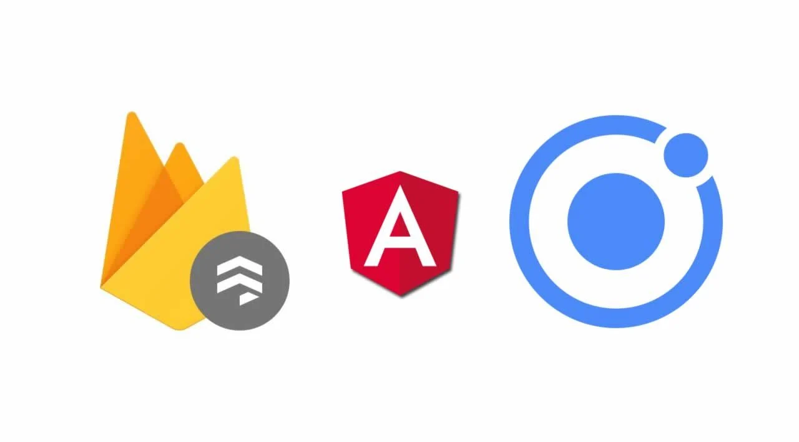

<h4><b>“Don’t be afraid of failure. This is the way to succeed.” ~ LeBron James</b></h4>

Since we already reported on our project last time, today we are introducing you to our features that we 
  want to implement in our app and which technology we will use for it. 
 
 
Starting with our main objective, we'd like you to be able to track your personal fitness progresses.
  
In order to achive this we want to implement the following features:
 
<ol>
<li>create your personalized training schedule</li>
<li>see a statistic of your progress (weight etc.)</li>
<li>achieve challenges or create your own</li>
<li>have a calendar to plan your workouts or challenges</li>
</ol> 

Furthermore, we thought about features which would be nice to have:
  
<ol>
<li>User-Management-System</li>
<li>possibility to follow other people</li>
<li>being able to share your progress</li>
<li>meal planning and tracking your nutritional values</li>
<li>track your walking distance</li>
</ol>
  

<h1>Technologies</h1>

For the frontend we will use Capatior, Ionic, HTML, CSS, TypeScript and Angular.

Especially for the additional functions we also need a backend. Here we will use Firebase.

Angular is a platform for building mobile and desktop web applications.
Firebase is a development platform for mobile and web applications. It provides tools and infrastructure via a software development kit that are intended to enable developers to provide functions more easily and more efficiently using programming interfaces on various platforms.
Ionic Framework is an app development platform which build amazing cross-platform mobile, web, and desktop apps all with one shared code base and open-web standards.

   
  
  
<h1>Roles</h1>
  
Our team consists of three members: Moritz, Rouven and Sebastian. We decided to stick with the disciplines of RUP roles and not to go too deep with our role descriptions:
   
  <b>Sebastian</b>:  Project Management, Implementation, Requirement, Business Modelling  
<b>Rouven</b>: Implementation, Test, Analysis and Design, Requirement, Blog and Review Manager  
<b>Moritz</b>: Implementation, Deployment, Environment, Configuration and Change Management  
     
We look forward to realize our ideas and welcome your feedback.  

All the best,  

Your workout-log team!     

 

{:.list-inline}
