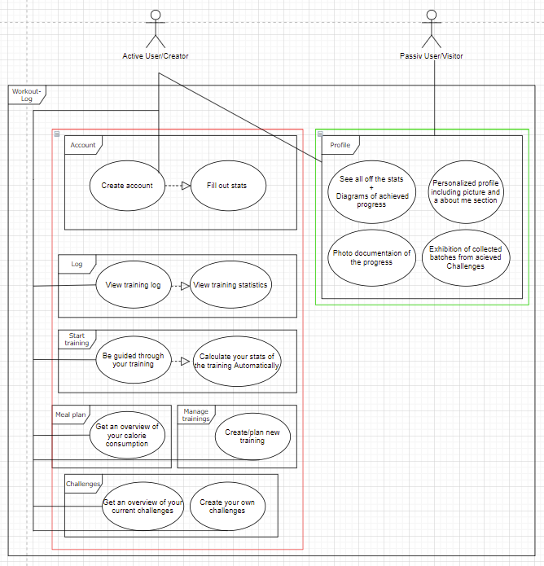

<h4><b>“I don't eat for taste, I eat for function.”</b></h4>

  

  This week we created our usecase diaagram for the Workout-Log application.
  

  
  As you can see here we have two actors a passiv visitor and a active user.
  The red highlighted part is only accesabel by the active user 
  and contains all the features for training and documenaion off your progress.
  The green part is the profile where all the stats off the Active user are pressented
  and is visabel for other pasiv users.
  the green section is also the part where diffrent users can compare there progress and find 
  inspiration and idols.
   
   
  We also created this week our SRS where we discriped ourer prozesses in more deatil. 
   
  Some exampels you can find there:
   
   
 <ol>
<li>Scope</li>
<li>Overall Desciption</li>
<li>Functionality</li>
<li>Interfaces</li>
</ol> 
  
  
  so if your want to learn more about the workout-log here is the link for oure <a href="https://github.com/DHBW-TrainingApp/Blog/blob/main/docs/SoftwareRequirementSpecification.md">SRS</a>
  

All the best,  

Your workout-log team!     

 

{:.list-inline}
