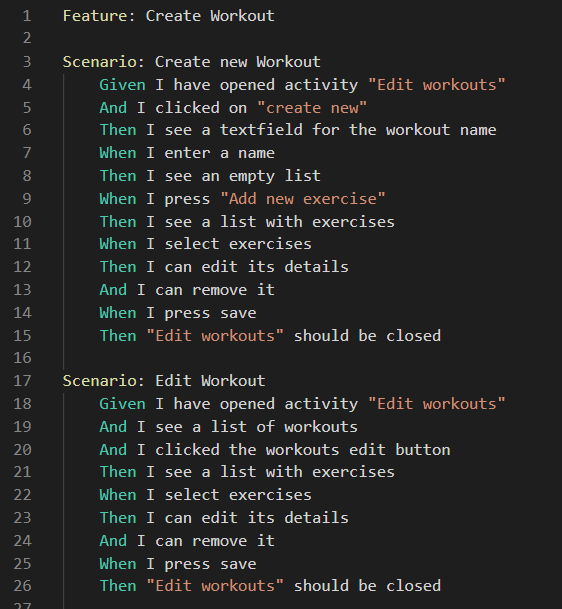
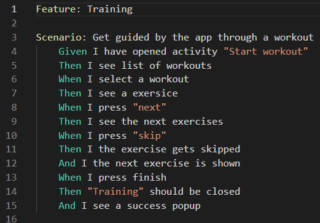

 "Strength does not come from physical capacity. It comes from an indomitable will."
  
    
  
This week we created the feature files for two of our use cases.
This task was very helpful for us to get a better understanding on how we want to implement these features later on.
The process of creating the feature files also helped us to get an overall understanding on 
what needs to be done for the features and how many scenarios need to be payed attention for, even for very simple features  
  
This one is for creating new workouts or editing existing ones. You can find more to it <a href="https://github.com/DHBW-TrainingApp/Blog/blob/main/docs/UCs/createWorkout.md">here</a>  
  

The second one deals with the procedure of a started interactive workout. The link towards this Use Case Specification is: <a href="https://github.com/DHBW-TrainingApp/Blog/blob/main/docs/UCs/Training.md">Click here </a>  

    
  
All the best,  

Your workout-log team!     

 
  
               
  

{:.list-inline}
