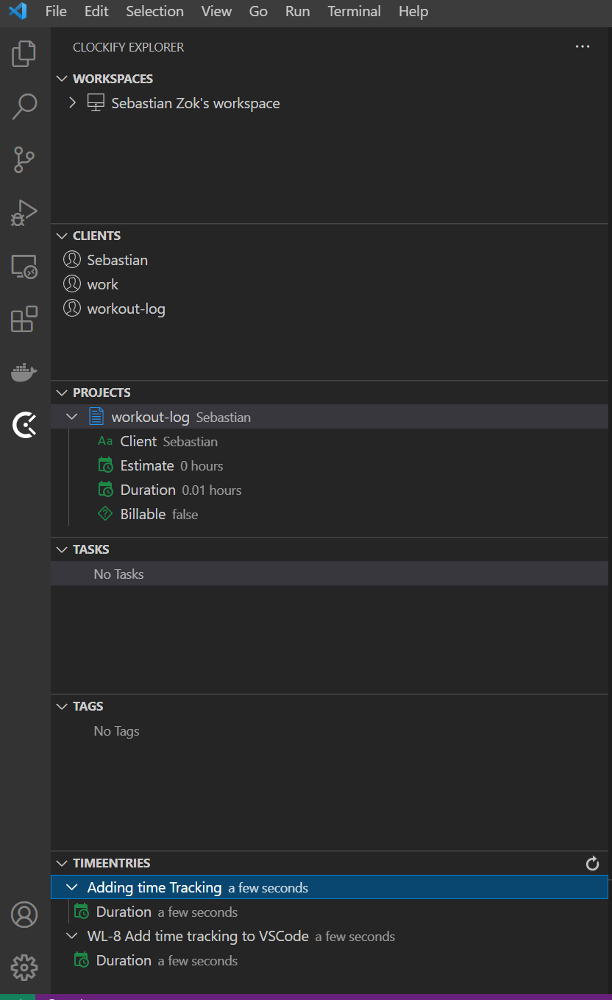
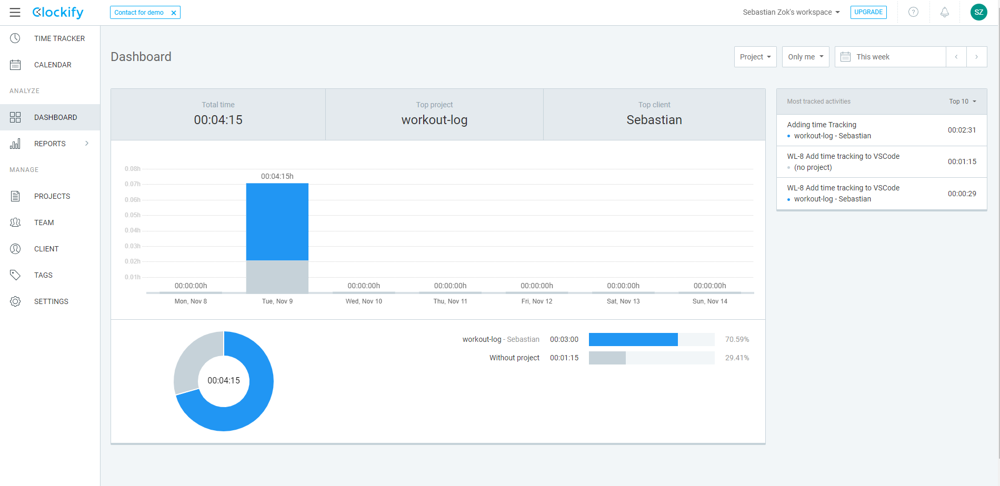
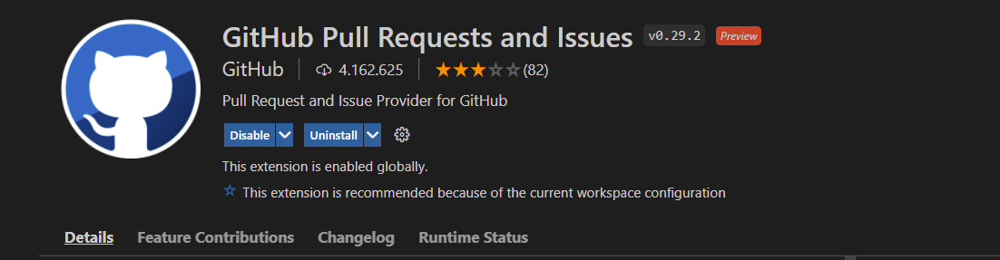
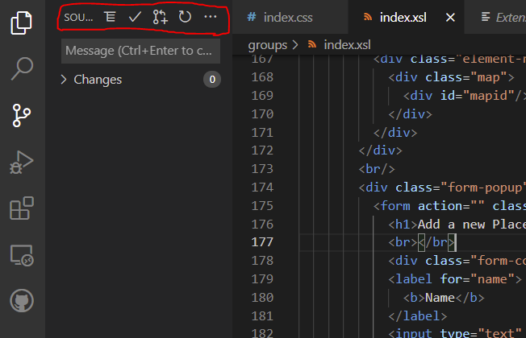
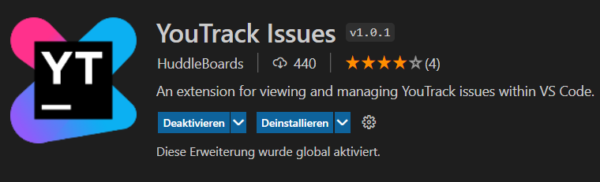
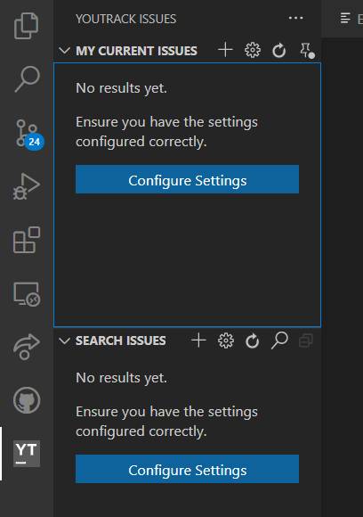

  "The two most powerful warriors are patience and time" – Leo Tolstoy, War and Peace.
  
    
  
  This week we started to enhance our YouTrack Scrum-Board with additional Features and to pimp our IDEs a little bit.
  
  First of all, we wanted to improve or time tracking, because being dependent on raw estimations isn't the way we wanted to go.
  
  For this we started to search for different extensions and come up with Clockify.
  
  The setup was quite straightforward and we managed to add Clockify in our IDEs (VSCode) and to our Youtrack Website, through a Chrome extension.
  
  The usage of Clockify is very easy. Each issue has now a "Start Timer" button next to it, which can be used to start and stop our timer. 
    
  
    
  It's also possible to start the timer inside VSCode, but we decided that pressing a button inside the browser is much more intuitive than starting it through a command inside VScode.
  So we prefer the usage of Clockify's Chrome Extension. 
    
  
    
  Under clockify's website you can also log in with your account and have a look on many diagrams, as you can see here: 
  
  
   
  
  
  Another urgent feature is to link github and vs code. 
  For this we used the following extention. 
  This was also very easy to install and set up.
  
    
   
  
  
  In the following picture you can see the buttons added by the extension, which allow you to commit or push by clicking a button.
  Furthermore it is helpful to see the changes within vs code.
  
  
    
   
  
  
  Furthermore, we installed a Youtrack extension in Visual Studio Code to be able to create new issues there as well and to have direct access to them.
    
  
    
  This extension was created to optimize the work for those who manage their issues in YouTrack. 
  It aims to bring the most used features of YouTrack to your VS Code environment.

  The extension has two views in the sidebar that allow you to, 
  view a list of the current user's problems and another list with the results of a selected saved search.

    
  To use this extension you have to install it in your VS Code environment and follow the steps down below. 
  The only two steps to do are to enter a token in the VS-youtrack settings, which you can create in your youtrack profile, and to enter the corresponding sub     domain. After rebooting your VS environment you will see a new icon (YouTrack) on the left side bar. Here you can now create new issues.
    
  
    
    
  All the best,  

  Your workout-log team!     

 
  
               
  

{:.list-inline}
