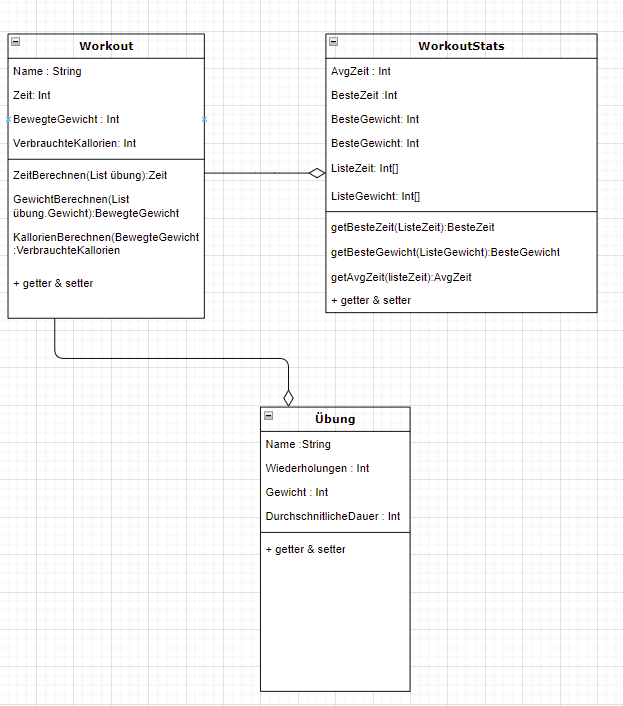

---

  ¨Some people want it to happen, some wish it would happen, others make it happen.¨ – Michael Jordan
  
    
  
  this week was really interesting for us. we started to implement our app prototype which is of course a big step closer to our goal. we still try not to rush and take it one step at a time as we did before. this includes making a class diagram.
in the following picture you can see how we did this for our workout-edit screene and how we imagine to implement the single workouts later. 
  
  
  

  
    

we hope to give you a short insight into what we are working on at the moment. 
  in the next blogs you will also learn more and more about our progress on the app.

    
    
  All the best,  

  Your workout-log team!     

 
  
               
  

{:.list-inline}
