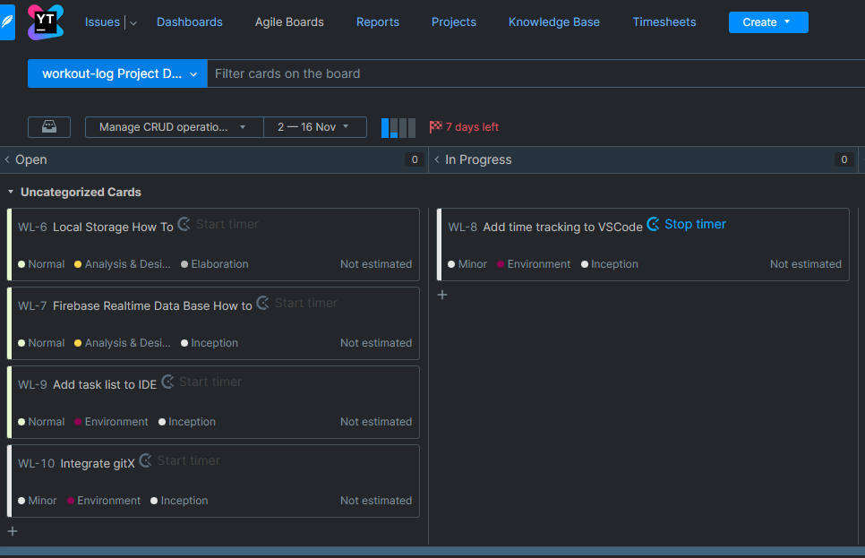

---
title: WEEK 7
subtitle: Class Diagramm

caption:
  title: Week 7
  subtitle: Class Diagramm
  thumbnail: https://images.freeimages.com/images/large-previews/421/polar-bear-calisthenics-1394792.jpg
---

  "The two most powerful warriors are patience and time" – Leo Tolstoy, War and Peace.
  
    
  
  this week was really interesting for us. we started to implement our app prototype which is of course a big step closer to our goal. we still try not to rush and take it one step at a time as we did before. this includes making a class diagram.
in the following picture you can see how we did this for our workout-edit screene and how we imagine to implement the single workouts later. 
  
  
  

  
    

    
    
  All the best,  

  Your workout-log team!     

 
  
               
  

{:.list-inline}
