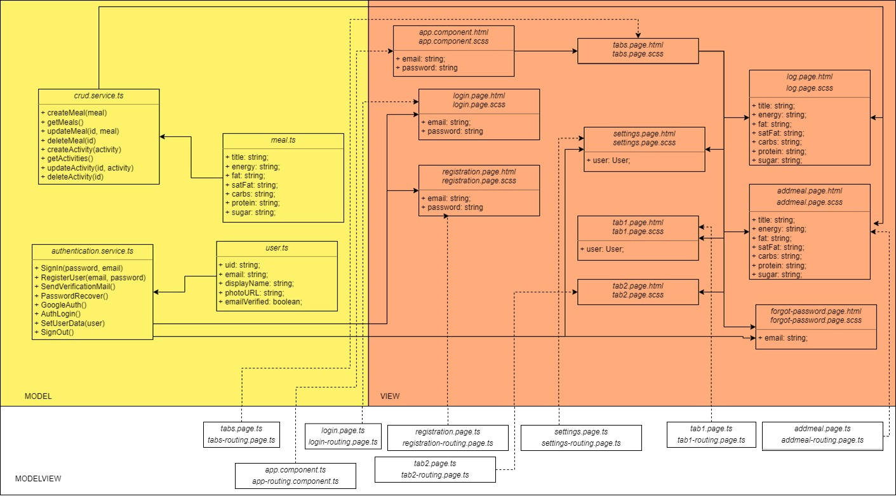

---

  ¨The Pain you feel today will be the Strength you feel tomorrow¨    
  
  
  
      
  
 This week there are more diagrams. we have been working on an MVVM model. the main difference between an MVVM and an MVC is that instead of a controller you have a view model. There are also a few advantages, one is a loosely coupled architecture, you can write unit test cases for the view model as well as the model layer without having to change anything.    

  The above model represents only the current state of our project, there will surely be some changes and new things added. Also, we hope that soon all our main features will be ready and we can present them to you :)   
  
  we hope we bin abel to give you a little insight into our week and our progress    
  
 
  All the best,  

  Your workout-log team!     

 
  
               
  

{:.list-inline}
