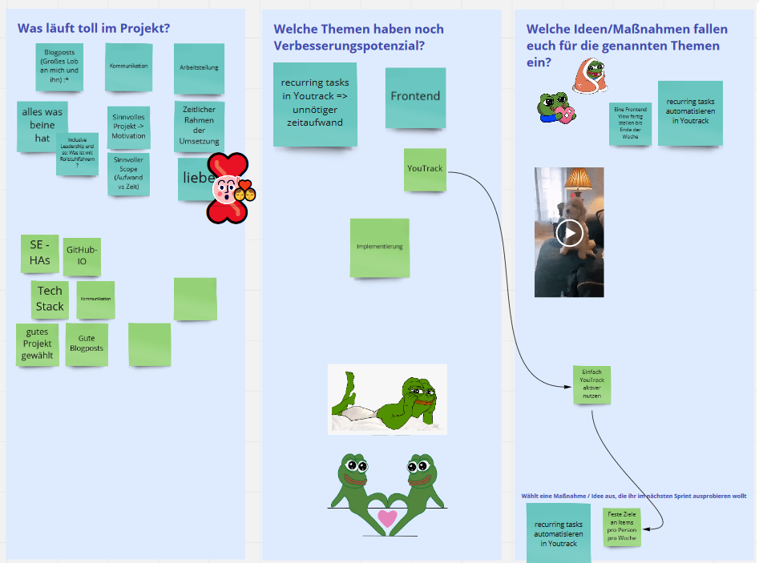

---

  ¨The Pain you feel today will be the Strength you feel tomorrow¨    
  
  
  
      
  
 This week there are more diagrams. we have been working on an MVVM model. the main difference between an MVVM and an MVC is that instead of a controller you have a view model. There are also a few advantages, one is a loosely coupled architecture, you can write unit test cases for the view model as well as the model layer without having to change anything.    

  The implementation of the previous weeks, respectively the implementation goals, worked also well so far. Everyone in our group has currently been assigned a fixed task that relates to the implementation phase of our project.   
  
  Last but not least, let's take a look at the topic of time. 
  In terms of the project, i.e. the implementation / programming, we are still well on schedule. Compared to other projects from our course, we have already started early with the implementation, so that we are currently not feeling any stress.
  Time is actually only short when it comes to handing in the homework "peer reviews & blog writing". Here we are often a bit late - something we really want to work on.    
  
  Here's a picture of the board from our retrospective:  
  
  
  

   
    
  All the best,  

  Your workout-log team!     

 
  
               
  

{:.list-inline}
