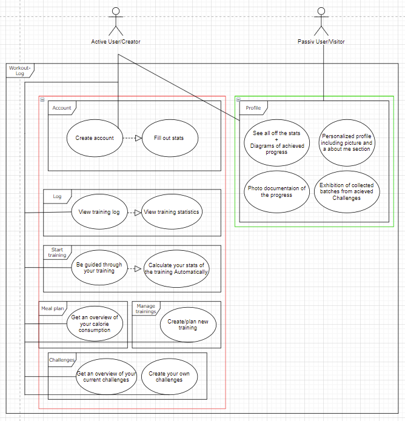

# Common Playground - Software Requirements Specification 

## Table of contents
- [Table of contents](#table-of-contents)
- [Introduction](#1-introduction)
    - [Purpose](#11-purpose)
    - [Scope](#12-scope)
    - [Definitions, Acronyms and Abbreviations](#13-definitions-acronyms-and-abbreviations)
    - [References](#14-references)
    - [Overview](#15-overview)
- [Overall Description](#2-overall-description)
    - [Vision](#21-vision)
    - [Use Case Diagram](#22-use-case-diagram)
	- [Technology Stack](#23-technology-stack)
- [Specific Requirements](#3-specific-requirements)
    - [Functionality](#31-functionality)
    - [Usability](#32-usability)
    - [Reliability](#33-reliability)
    - [Performance](#34-performance)
    - [Supportability](#35-supportability)
    - [Design Constraints](#36-design-constraints)
    - [Online User Documentation and Help System Requirements](#37-on-line-user-documentation-and-help-system-requirements)
    - [Purchased Components](#purchased-components)
    - [Interfaces](#39-interfaces)
    - [Licensing Requirements](#310-licensing-requirements)
    - [Legal, Copyright And Other Notices](#311-legal-copyright-and-other-notices)
    - [Applicable Standards](#312-applicable-standards)
- [Supporting Information](#4-supporting-information)

## 1. Introduction

### 1.1 Purpose
This Software Requirements Specification (SRS) describes all specifications for the application "workout-log". It includes an overview about this project and its vision, detailed information about the planned features and boundary conditions of the development process.

### 1.2 Scope
The project is going to be realized as an Android App.  
  
Actors of this App can be users.  
  
Planned Subsystems are: 
* Homepage:  
The Dashboard is the starting area of the user interface. Here he gets a rough overview of his progress, the latest infos and access to the other pages.
* Account System:  
Users can create accounts so workouts can be connected to a person as well as to join requests. User data must be stored alongside the posting data.
* Log-Dashboard:  
The Log-Dashboard is the essential part of the user interface. Here he can get track of his progress, add new activities or add custom activities.
* Workout-creation System:  
Users can create workouts and/or modify them.
* Workout-Executing System:  
Here users can start workouts, see the next excersises and get recommendations for breaks.
* Storing Data:  
User data for accounts and possibly custom workouts has to be stored. The data storage will form the foundation for the visualization, account system and the search feature.
* Finding new Activities:  
Find new workouts and challenges.

### 1.3 Definitions, Acronyms and Abbreviations
| Abbrevation | Explanation                            |
| ----------- | -------------------------------------- |
| SRS         | Software Requirements Specification    |
| UC          | Use Case                               |
| n/a         | not applicable                         |
| tbd         | to be determined                       |
| UCD         | overall Use Case Diagram               |
| FAQ         | Frequently asked Questions             |

### 1.4 References

| Title                                                              | Date       | Publishing organization   |
| -------------------------------------------------------------------|:----------:| ------------------------- |
| [Workout-log Blog](https://dhbw-trainingapp.github.io/)            | 19.10.2021 | workout-log  Team         |
| [GitHub](https://github.com/DHBW-TrainingApp)                      | 19.10.2021 | workout-log  Team         |

### 1.5 Overview
The following chapter provides an overview of this project with vision and Overall Use Case Diagram. The third chapter (Requirements Specification) delivers more details about the specific requirements in terms of functionality, usability and design parameters. Finally there is a chapter with supporting information. 
    
## 2. Overall Description

### 2.1 Vision
Our app will allow the user to track their progress in order to get the necessary motivation for the best possible success. In addition, it will provide additional motivation by allowing users to network and compete with others.

### 2.2 Use Case Diagram

- Green: Planned till end of december
- Yellow: Planned till end of june

### 2.3 Technology Stack
The technology we use is:

Backend:
-Firebase
-NoSql

Frontend:
-Typescript
-Ionic
-Android
-Capacitor
-Angular

IDE:
-VSCode

Project Management:
-YouTrack
-GitHub

Testing:

## 3. Specific Requirements

## 3.1 Functionality
The Subsystems are:

- Account System:
Users can create accounts where their data (Profile information, Badges etc.) must be stored.

- Connecting People:
An important aspect is connection the members. This will be reached by making it possible to interact with highscores or shared workouts. 

- Storing Data:
User data for accounts needs to be stored. Also the training progress and history will be stored. The data storage will form the foundation for the visualization and the account system.

- Training Plans:
There are basic training plans provided by standard.
Furthermore the trainer can make training plans for you which are then showed in your app.

- Tracking trainings:
User can track their progess and save them in the app. .

The following section shows the different use cases which were implementes. Until December 2021
### 3.1.1 Account Creation (tbd)

### 3.1.2 Start a workout

### 3.1.3 Get an badge (tbd)

### 3.1.5 Create a workout

## 3.2 Usability
Our user interface has an intuitive design which should be self-explanatory for the user. 
## 3.3 Reliability
Our usage of Firebase as a Backend as a Service Provider, should provide our app (except for configuration errors) a very high reliability
## 3.4 Performance
No complex calculations are made in the application. So the performance, despite using Ionic, should be high. The most time-consuming tasks are the requests to the backend database. 
## 3.5 Supportability
We want to deliver regular updates for the Android application via the Playstore. Our web application and the backend are updated regularly via the CI/CD pipeline (tbd).
## 3.6 Design Constraints
Due to the free billing plan of the Firebase-service our App will be constrained by a limited request amount.
## 3.7 On-line User Documentation and Help System Requirements
n/a
## 3.8 Purchased Components
No purchased components are planned at the moment (tbd). 

## 3.9 Interfaces
### 3.9.1 User Interfaces
The user interfaces that are implemented for the mobile app are:
- Registration Pages (tbd)
- Login Page (tbd)
- Dashboard
- Workout Overview
- Profile Overview (tbd)
- Log Page
- Workout edit Page
- Training exercises Page
- Challenge Page (tbd)
- Network following page (tbd)
- Create Workout Page

### 3.9.2 Hardware Interfaces
n/a
### 3.9.3 Software Interfaces
We will support the Angular web app for all common browsers (Chrome, Firefox, Opera, Safari). We will not support the Internet Explorer for the application. Through ionic a move to IOS or Microsoft as operating system, should also be relatively easy

### 3.9.4 Communication Interfaces
For the communication between client and server, we will use the HTTPs protocol. (tbd)
## 3.10 Licensing Requirements

### 3.11 Legal, Copyright, and Other Notices
We do not take responsibilty for any incorrect data or errors in the application.

### 3.12 Applicable Standards
The development will follow the common clean code standards and naming conventions.

## 4. Supporting Information
For any further information you can contact the Common Playground Team or check our [Workout-log Blog](https://dhbw-trainingapp.github.io/) . 
The Team Members are:
- Moritz Sternjakob
- Rouven Gremsperger
- Sebastian Zok
