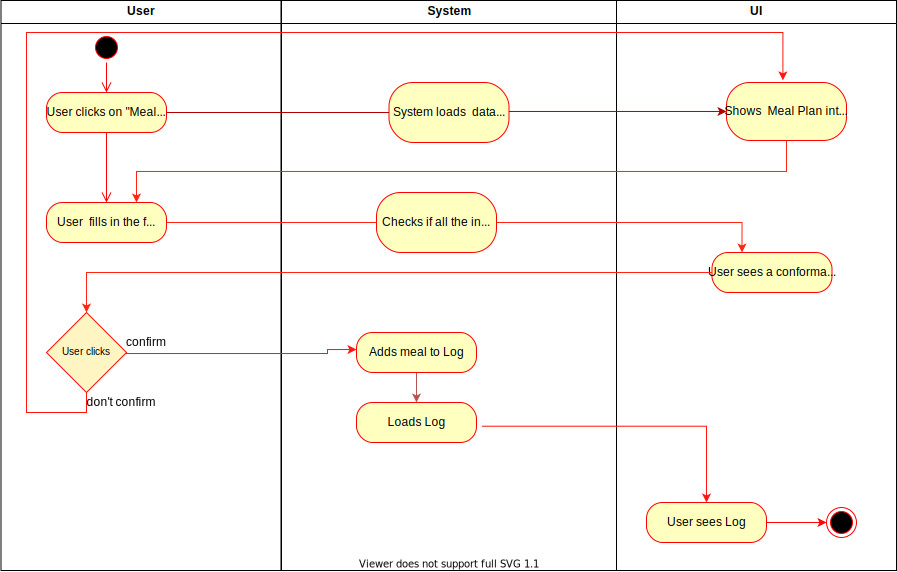

# 1 Use-Case Name
Meal Plan

## 1.1 Brief Description
Users can create new meals and add them to their logs

# 2 Flow of Events
## 2.1 Basic Flow
- User clicks on "Meal Plan" Icon
- User fills in the the form for his meal
- User clicks on "Add meal"
- User can Confirm his meal
- User will we forwarded to the Log

### 2.1.1 Activity Diagram

### .feature File

### 2.1.2 Mock-up

### 2.1.3 Narrative
After a meal, the user wants to add it to his statistics in the app or share it with his followers. 
the user also wants to do it as fast as possible without much hassle so that it becomes easily a habit.

## 2.2 Alternative Flows
(n/a)

# 3 Special Requirements
(n/a)

# 4 Preconditions
## 4.1 User has to have a account
User needs to be logged in

# 5 Postconditions
User has a meal added to the Log
 
# 6 Extension Points
(n/a)
