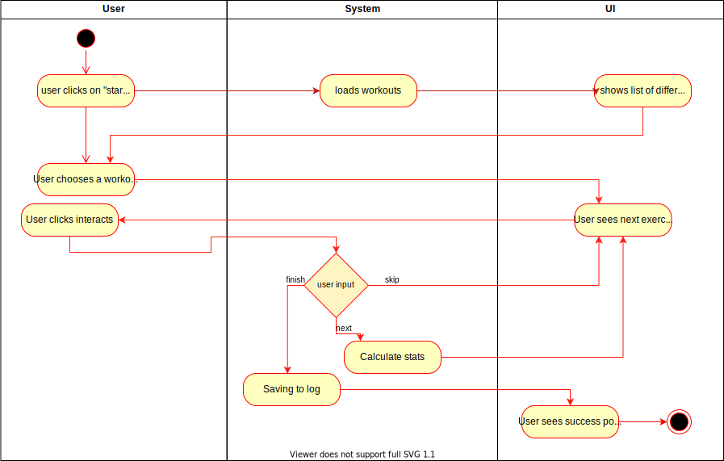

# 1 Use-Case Name
Starting operation for a new workout session.

## 1.1 Brief Description
User picks between different workouts and starts it.

# 2 Flow of Events
## 2.1 Basic Flow
User clicks on "start new workout" button
User picks workout out of list
User will be sent to the details view of the exercise (Repetitions, breaks, sets). 
User clicks on "skip" to be send to the next exercise, without saving.
User clicks on "next exercise" to be send to the next exercise, with saving progress.
User clicks on "finished" to close the workout with saving it to the workout-log.

### 2.1.1 Activity Diagram

### 2.1.2 Mock-up

### 2.1.3 Narrative

## 2.2 Alternative Flows
(n/a)

# 3 Special Requirements
(n/a)

# 4 Preconditions
## 4.1 Login
The user has to be logged in to the system.

# 5 Postconditions
(n/a)
 
# 6 Extension Points
(n/a)
