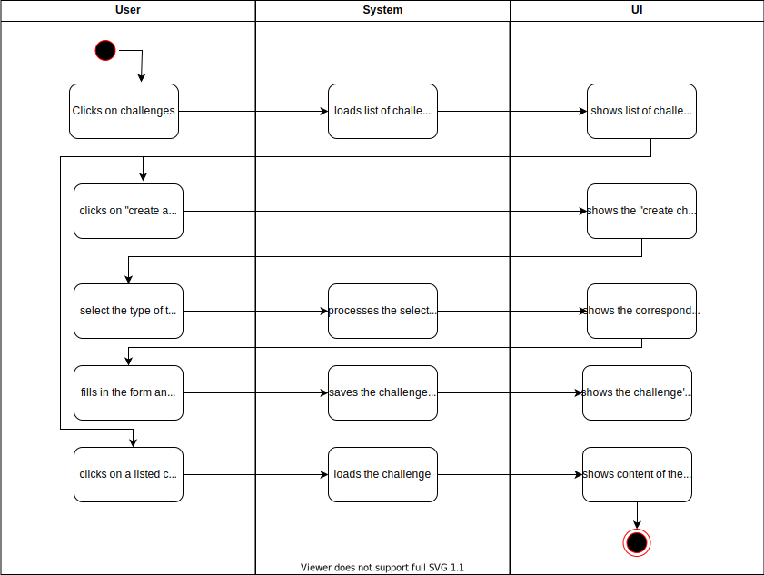

# 1 Use-Case Name
View and create challenges

## 1.1 Brief Description
The user will be able to create challenges to compete whether with him-/herself or with other people. There will be different types of challenges and you can also view them after creating them. 

- MORE COMING SOON

# 2 Flow of Events
## 2.1 Basic Flow
- User clicks on "Challenges" button
- User clicks on "create a challenge"
- User choose the type of challenge and enters the button
- User is now able to fill in the form
- User clicks on "create challenge"
- User is redirected back to the challenge's main page

### 2.1.1 Activity Diagram

### .feature File

### 2.1.2 Mock-up

### 2.1.3 Narrative

## 2.2 Alternative Flows
(n/a)

# 3 Special Requirements
(n/a)

# 4 Preconditions
## 4.1 Mail
The user needs to have a mail account

# 5 Postconditions
User is logged in 
 
# 6 Extension Points
(n/a)
