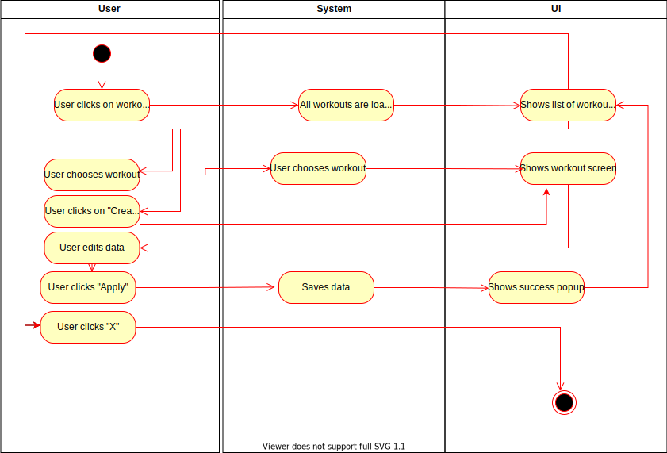

# 1 Use-Case Name
Create operation for new workouts

## 1.1 Brief Description
Every logged-in user can create new workouts. To create a workout the creator must provide information about the upcoming operation, like

- choosen exercises... 
- MORE COMING SOON

# 2 Flow of Events
## 2.1 Basic Flow
- User clicks on "create new workout" button
- User fills in the the form (Name, Duration, Target)
- User clicks on "add" to add a new exercise to the workout, he will be sent to the details view of the exercise (Repetitions, breaks, sets). A success toast will be shown.
- User clicks on "remove" to remove the exercise. A success message will be shown.
- User clicks on "save" to close the form with saving the workout.
- User clicks on "close" to close the form without saving the workout.

### 2.1.1 Activity Diagram

### 2.1.2 Mock-up

### 2.1.3 Narrative

## 2.2 Alternative Flows
(n/a)

# 3 Special Requirements
(n/a)

# 4 Preconditions
## 4.1 Login
The user has to be logged in to the system.

# 5 Postconditions
(n/a)
 
# 6 Extension Points
(n/a)
