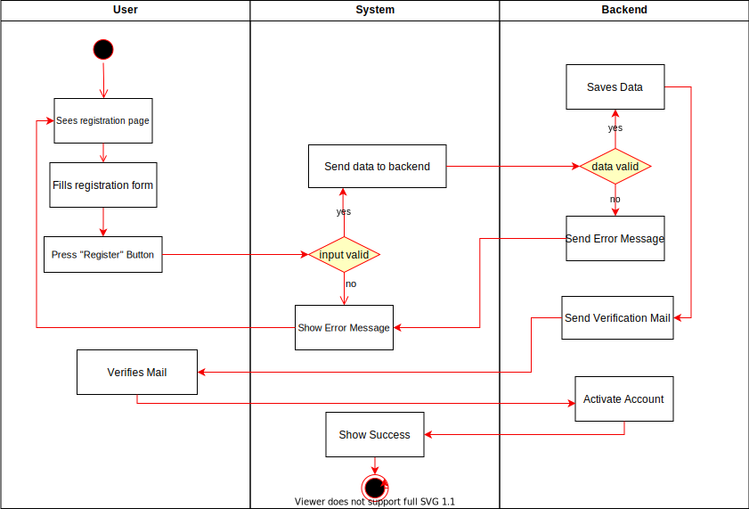

# 1 Use-Case Name
Registration with email

## 1.1 Brief Description
The user has the option to login via email or OAuth (Google). If he*she wants to use the classic way via email, they need to registrate and activate their email.

- MORE COMING SOON

# 2 Flow of Events
## 2.1 Basic Flow
- User clicks on "create new account" button
- User fills in the the form (Name, mail, password)
- User clicks on "Registrate" 
- User receives a verification mail
- User verifies mail
- User can login using the new account

### 2.1.1 Activity Diagram

### .feature File

### 2.1.2 Mock-up

### 2.1.3 Narrative

## 2.2 Alternative Flows
(n/a)

# 3 Special Requirements
(n/a)

# 4 Preconditions
## 4.1 Mail
The user needs to have a mail account

# 5 Postconditions
User is logged in 
 
# 6 Extension Points
(n/a)
